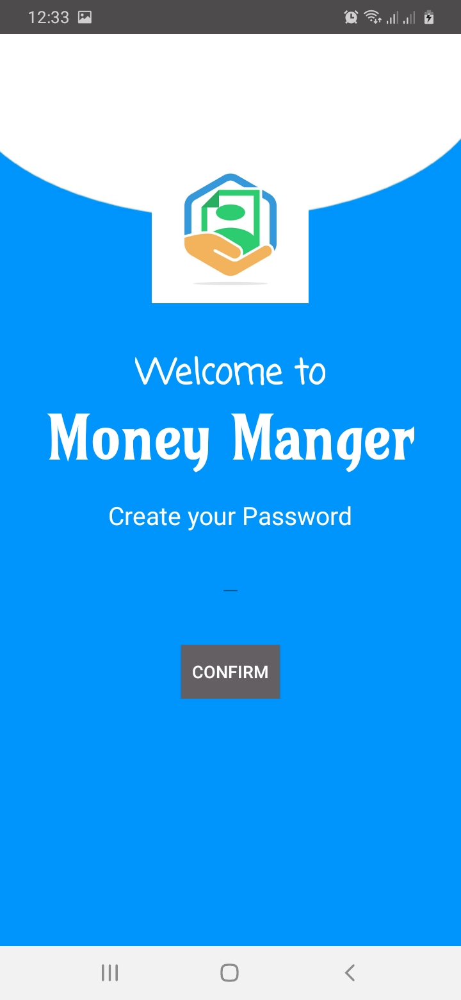
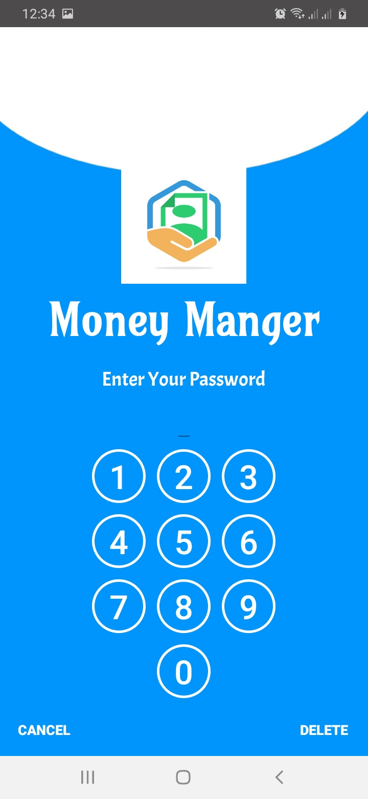
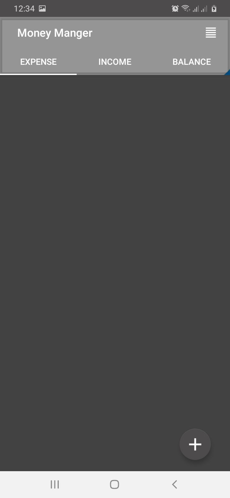
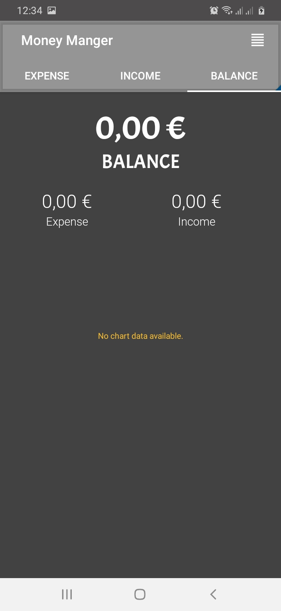
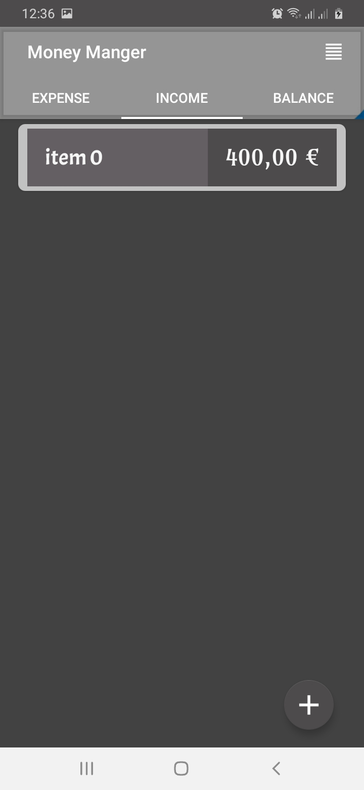
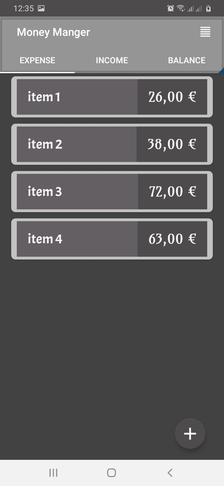
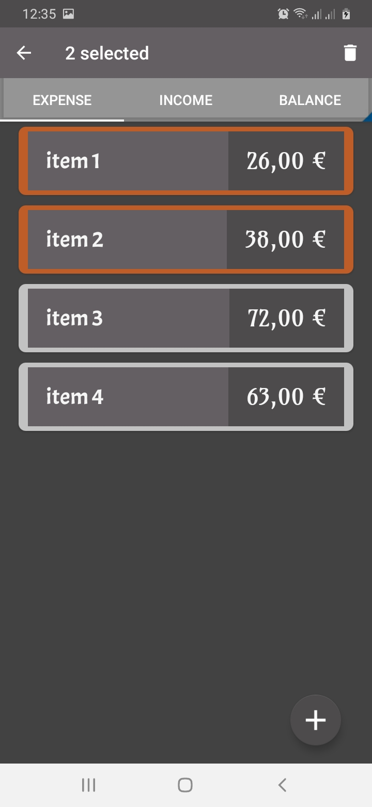
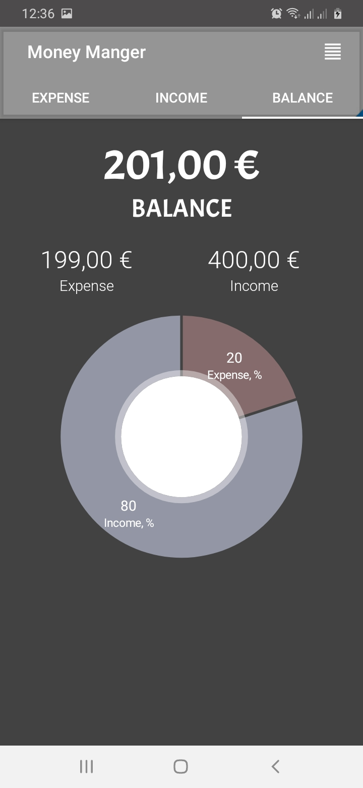
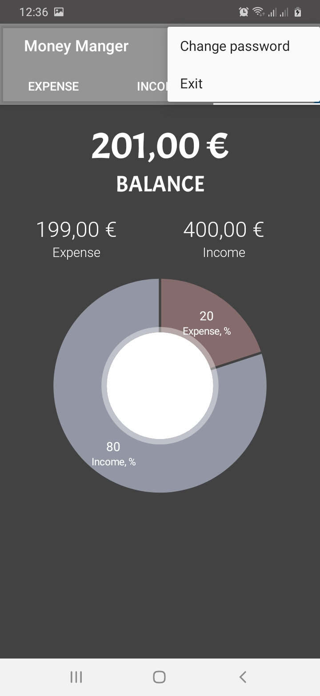

# Money Manager

   
>This is a simple android application that is dedicated to manage your money.
>You basicly add icomes and expenses, also keep track on your balance. This will make your life >much easier, since you will gain more control on your finance.

## Project description:
The user should sign in to use the application. All the information is stored localy.
The applications store expenses and incomes of the user in sqlite database. Also it calculate the balance and give statistics about it.

## Project Overview:
* Welcoming splash screen:

* Sign up page:

* Sign in page:

* Expenses page:

* Balance page:

* Adding Income:

* Adding expenses:

* Managing expenses:

* Updating balance:

* Manage user information:
